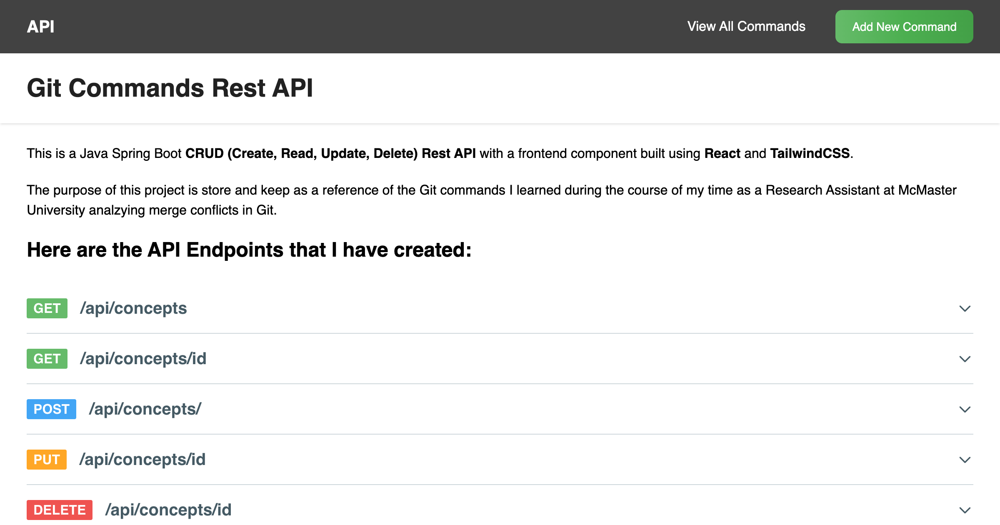
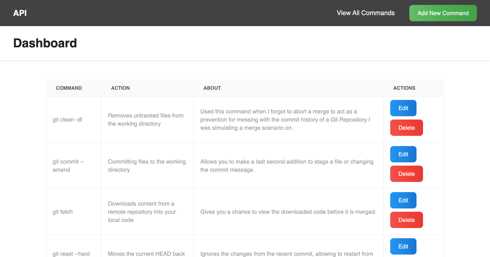
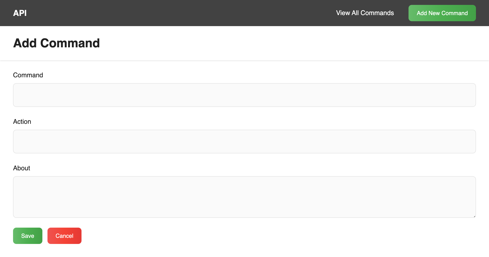

# Git Commands Full Stack Application 

#### With so many Git Commands available to use, having an API to help me remember the ones I used regularly during my Research Internship will help me develop my skills with navigating and operating Git. 

### The goal of this project was to:
- Learn Java
- Build a REST API using the Spring Boot framework
- Work with a cloud based Database (MySQL on Azure)
- HTTP CRUD (Create, Read, Update, Delete) 
- Testing API endpoints using Postman
- Building a frontend using React and Tailwind CSS

## Here are the pages I created for the Front End 

### Home Page

### View All Commands

### Add a Command

